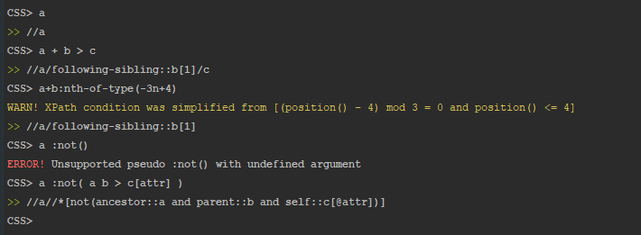

#convert-cssxpath

## Yet another CSS to XPath converter
Simple and correct XPath output, that's all

<span style="display:block;text-align:center"></span>

## Install
`$ npm i convert-cssxpath`

## Usage
Require:
```js
var cssxpath = require('convert-cssxpath');
```
Convert and get string:
```js
cssxpath.convert('a b > c');
```
Or call interactive console:
```js
cssxpath.ask();
```
Convert and get object (dev mode):
```js
cssxpath.convert('a:nth', true);
```
```js
// returns object: 
    { xpath: '//a[(position() - 1) mod 2 = 0]',
      warning: 'XPath condition [position() >= 1] was omitted',
      error: undefined }
```

### Convert
When using convert(css) function - logs are printed directly in console. For example:
```js
console.log(cssxpath.convert('[]invalid-css'));
```
Empty string is returned. Console logs:
```js
// ERROR! Invalid CSS selector.
```

__Developer mode__ makes it easy to overwrite logs behavior. For example:
```js
var css = 'a b > c';
var xpath = cssxpath.convert(css, true);
console.log( xpath.error ? `Seems your CSS '${css}' was wrong!` : css );
```
To turn on __Developer mode__ and receive _object_ instead of _string_, simply put 'true' as the second parameter after css.
Logs are not printed in console in Developer mode.

### Pseudo-classes
Use __:not(_selector_)__. Multiply not() arguments are fully supported:
```js
cssxpath.convert(':not(a b > c[attr])');
```
Output:
```js
//*[not(ancestor::a and parent::b and self::c[@attr])]
```
_*Deep nesting [is experimental in CSS](https://developer.mozilla.org/en-US/docs/Web/CSS/:not), so it's better to avoid it._

Use __:nth-of-type(_nth_)__:
```js
cssxpath.convert('a:nth-of-type(odd)');
```
Output:
```js
//a[(position() - 1) mod 2 = 0]
```

Use __:nth-child(_nth_)__. N-based syntax (e.g. -3n+2 etc) if fully supported for all nth- pseudos:
```js
cssxpath.convert('a+b:nth-child(n+3)');
```
Output:
```js
//a/following-sibling::b[1][count(preceding-sibling::*) >= 2]
```


## What is next
Coming soon: support of remaining pseudo-classes: 
- :nth-last-child(n)
- :nth-last-of-type(n)

## Test
`$ npm test` - run over 250 tests

#### Changelog
_`v.1.0.1 - full support of :nth pseudos; documentation; dev mode; error fixes`_

_`v.0.0.4 - full support of :not(selector)`_

